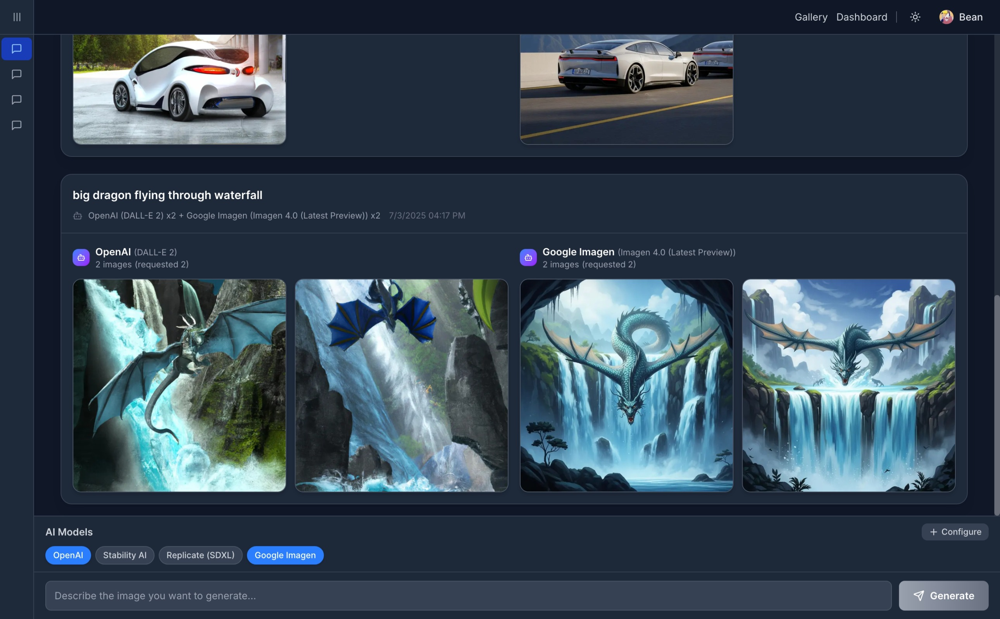

# AIRouter - Multimodal AI Image Generation Platform

A modern Next.js 15 application that provides a unified interface for generating images using multiple AI providers including OpenAI DALL-E, Stability AI, and Replicate.

## Features

- 🎨 **Multiple AI Providers**: Support for OpenAI DALL-E, Stability AI, and Replicate
- ✏️ **Image Editing**: Edit and modify generated images with AI (Pro feature)
- 🌓 **Dark/Light Mode**: Toggle between themes with system preference detection
- ⚡ **Fast & Modern**: Built with Next.js 15, TypeScript, and Tailwind CSS
- 🎯 **Smart Routing**: Automatic provider fallback and selection
- 📱 **Responsive Design**: Works beautifully on all devices
- 🔄 **Real-time Generation**: Live image generation with progress indicators
- 💎 **Premium Features**: Paid users get access to advanced features like image editing

## Getting Started

### Prerequisites

- Node.js 18+ or bun
- API keys from one or more providers:
  - [OpenAI API Key](https://platform.openai.com/api-keys)
  - [Stability AI API Key](https://platform.stability.ai/account/keys)
  - [Replicate API Token](https://replicate.com/account/api-tokens)

### Installation

1. Clone the repository:

```bash
git clone https://github.com/Ad-Bean/airouter
cd airouter
```

2. Install dependencies:

```bash
npm install
# or
pnpm install
# or
bun install
```

3. Set up environment variables:

```bash
cp .env.example .env.local
```

4. Edit `.env.local` and add your API keys:

```bash
# OpenAI API Key (required for DALL-E)
OPENAI_API_KEY=your_openai_api_key_here

# Stability AI API Key (required for Stability AI)
STABILITY_API_KEY=your_stability_api_key_here

# Replicate API Token (required for Replicate)
REPLICATE_API_TOKEN=your_replicate_api_token_here

# Google Gemini API Key (required for Gemini image editing)
GEMINI_API_KEY=your_gemini_api_key_here
```

5. Run the development server:

```bash
npm run dev
# or
pnpm dev
# or
bun dev
```

6. Open [http://localhost:3000](http://localhost:3000) to see the application.

## Demo

Below is an example of an AI-generated image using the platform:



## API Providers

### OpenAI DALL-E

- **Models**: DALL-E 2, DALL-E 3
- **Strengths**: High quality, good prompt following
- **Best for**: Artistic images, creative concepts

### Stability AI

- **Models**: Stable Diffusion XL, SD 1.6
- **Strengths**: Fast generation, customizable
- **Best for**: Realistic images, fine-tuned control

### Replicate

- **Models**: SDXL, various community models
- **Strengths**: Open source, flexible
- **Best for**: Experimental generation, custom models

### Google Imagen

- **Models**: Imagen 4.0
- **Strengths**: High quality, latest Google AI
- **Best for**: State-of-the-art image generation, natural scenes

## API Endpoints

### POST `/api/generate`

Generate an image using the specified provider.

**Request Body:**

```json
{
  "prompt": "A futuristic cityscape at sunset",
  "provider": "openai",
  "width": 1024,
  "height": 1024,
  "steps": 20
}
```

**Response:**

```json
{
  "success": true,
  "provider": "openai",
  "model": "dall-e-3",
  "images": ["https://..."],
  "usage": {
    "total_tokens": 25
  }
}
```

### POST `/api/images/edit`

Edit an existing image using AI (Pro feature only).

**Request Body:**

```json
{
  "imageUrl": "https://example.com/image.jpg",
  "prompt": "Add a rainbow to this image",
  "provider": "openai",
  "model": "gpt-image-1"
}
```

**Response:**

```json
{
  "success": true,
  "images": ["https://..."],
  "usage": {
    "total_tokens": 45,
    "input_tokens": 30,
    "output_tokens": 15
  }
}
```

**Error Response (Free User):**

```json
{
  "error": "Image editing is only available for paid users. Please upgrade your account."
}
```

**Supported Models:**

- **OpenAI**: `gpt-image-1`, `dall-e-2`
- **Google**: `gemini-2.0-flash-preview-image-generation`

### GET `/api/providers`

Check which providers are available based on configured API keys.

## Technology Stack

- **Framework**: Next.js 15
- **Language**: TypeScript
- **Styling**: Tailwind CSS
- **Animations**: Framer Motion
- **Icons**: Lucide React
- **AI SDKs**: OpenAI, Replicate

## Contributing

1. Fork the repository
2. Create a feature branch
3. Make your changes
4. Add tests if applicable
5. Submit a pull request

## License

MIT License - see LICENSE file for details.

## Support

If you encounter any issues or have questions, please open an issue on GitHub.
